# Trabajo Práctico N.º 1 — Análisis de Series Temporales

Tomas del Bo · Matias Villanueva · Juan Ignacio Paberolis

Universidad Austral — Maestría en Ciencia de Datos

# Resumen ejecutivo

Se analizan cuatro series diarias de Rosario: viajes del sistema de bicicletas públicas MBTB, temperatura, humedad y precipitación. El objetivo es describir sus patrones, comparar modelos de predicción y estudiar si la información climática previa se relaciona con la demanda. Los archivos contienen 1.096 días completos, entre el 1 de enero de 2023 y el 31 de diciembre de 2025.

Los modelos univariados se eligieron con una validación de 90 días dentro de 2023–2024. El año 2025 se reservó para evaluar predicciones desde un único origen, sin incorporar los datos reales de ese año. Se compararon SARIMA, referencias simples, ARIMA y suavizado exponencial. También se estimó un modelo conjunto VAR y se revisó la representación de los ciclos de calendario.

| Serie | MAE en 2025 | RMSE en 2025 |
| --- | --- | --- |
| Viajes MBTB | 512.524 | 635.599 |
| Temperatura | 3.959 | 4.926 |
| Humedad | 11.474 | 13.611 |
| Precipitación | 4.770 | 10.350 |

Los errores se expresan en las unidades de cada variable y no deben compararse entre variables. Los SARIMA de viajes, temperatura y humedad dejan alguna autocorrelación en sus residuos. En viajes aparece además un parámetro muy próximo al límite de invertibilidad. Por eso, los modelos son referencias de trabajo y no soluciones definitivas.

El VAR elegido tiene 2 rezagos y es estable, pero su prueba conjunta de residuos rechaza ausencia de autocorrelación (p=9.01e-05). Las pruebas de Granger y las respuestas a shocks se interpretan como resultados exploratorios. No demuestran causalidad real. Se presentan pronósticos de 30 días posteriores al último dato, con las limitaciones de cada modelo.

# Índice de contenido

1. Introducción y problema de interés — p. 4

2. Marco teórico — p. 5

3. Datos y exploración gráfica — puntos 1 y 2 — p. 6

4. Autocorrelación y raíces unitarias — puntos 3 y 4 — p. 8

5. Selección SARIMA y evaluación — puntos 5 y 6 — p. 10

6. Comparación con alternativas — punto 7 — p. 12

7. Diagnóstico de residuos — punto 8 — p. 13

8. Pronóstico de 30 días — punto 9 — p. 15

9. Modelo conjunto VAR — punto 10 — p. 17

10. Impulso-respuesta y Granger — punto 11 — p. 19

11. Revisión de estacionalidad — punto 12 — p. 22

12. Conclusiones — p. 24

13. Referencias — p. 25

Apéndices: parámetros, ejecución y archivos — pp. 26–27

El informe sigue la estructura solicitada. Los notebooks de cada punto contienen las tablas completas y el código. El archivo de entrega tp1_reproducible.py incluye los datos y las instrucciones para reconstruir los análisis.

# 1. Introducción y problema de interés

El uso de bicicletas públicas cambia según el día de la semana, la época del año y las condiciones climáticas. Estas variaciones importan para planificar la cantidad de bicicletas, su distribución entre estaciones y las tareas de mantenimiento. Un pronóstico puede apoyar esas decisiones, aunque no reemplaza el conocimiento operativo del servicio.

Se eligió la cantidad diaria de viajes como variable principal. La temperatura, la humedad y la precipitación permiten estudiar condiciones que podrían acompañar los cambios de demanda. Las cuatro series tienen la misma frecuencia y el mismo período, lo que facilita compararlas y construir un modelo conjunto.

La pregunta principal es qué modelos representan mejor los patrones temporales de cada serie y cuánto se equivocan al predecir datos posteriores. Una segunda pregunta es si el pasado de las variables climáticas agrega información para explicar los viajes, una vez incluidos sus propios valores anteriores y los patrones de calendario.

El alcance es observacional. No se dispone de experimentos, información individual de usuarios ni controles completos sobre feriados, disponibilidad de bicicletas, cambios de tarifa u otras decisiones del servicio. Las asociaciones encontradas no se interpretan como efectos causales.

## Datos y trazabilidad

El punto 1 atribuye los viajes al portal Datos Abiertos Rosario. Los CSV climáticos identifican variables y coordenadas, pero el proyecto no incluye una descarga verificable, una URL exacta de consulta ni metadatos completos de su proveedor. Por eso se utilizan como archivos suministrados para el ejercicio, sin atribuirles una fuente no comprobada. Esta limitación de procedencia se conserva en el informe.

Se mantienen los 1.096 días del proyecto. La consigna menciona una entrega en octubre de 2025, pero los archivos llegan hasta diciembre de ese año. El análisis respeta el contenido disponible; sus resultados no se presentan como una predicción realizada antes de aquella fecha.

# 2. Marco teórico

## Estacionariedad y diferencias

Una serie es estacionaria en sentido débil si su media y su varianza no cambian con el tiempo y la relación entre dos observaciones depende de la distancia entre ellas. Un ciclo visible no demuestra por sí solo una raíz unitaria. La diferencia diaria es Δy(t)=y(t)−y(t−1); la estacional es Δs y(t)=y(t)−y(t−s). Diferenciar sin necesidad puede agregar ruido y dificultar el modelo.

## Autocorrelación y modelos SARIMA

La FAC mide la relación con valores anteriores. La FACP descuenta las relaciones explicadas por los rezagos intermedios. En un AR(p) estacionario, la FACP teórica se corta después de p; en un MA(q), la FAC teórica se corta después de q. En muestras reales, estos patrones solo orientan la elección. Aquí FAS y FAC se tratan como nombres de autocorrelación simple y se agrega la autocovarianza como complemento, porque la consigna no define esas siglas.

El SARIMA se escribe: phi(B) Phi(B^s) (1-B)^d (1-B^s)^D y(t) = c + theta(B) Theta(B^s) epsilon(t). El operador B desplaza un dato hacia atrás. p y P indican términos de valores anteriores; q y Q, términos de errores anteriores; d y D, diferencias; s, duración del ciclo. Se usa la implementación de statsmodels, sin variables externas en el punto 5.

## Error y evaluación

Con e(t)=y(t)−ŷ(t), MAE=promedio de |e(t)|; RMSE=raíz del promedio de e(t)²; sesgo=promedio de e(t). Los dos primeros miden tamaño del error. El sesgo positivo indica que se predijo de menos. No se usa MAPE porque existen valores de precipitación iguales a cero. AIC y BIC equilibran ajuste y complejidad; no se comparan indiscriminadamente entre distintas diferencias o muestras.

## Modelo conjunto

Un VAR(p) tiene forma z(t) = c + A1 z(t-1) + ... + Ap z(t-p) + u(t). Cada ecuación utiliza rezagos de todas las variables. Se requiere un comportamiento estacionario y un sistema estable. Las respuestas a shocks dependen de cómo se separan las innovaciones. Granger evalúa información predictiva adicional y no demuestra una causa física (Statsmodels developers, s. f.-a).

# 3. Datos y exploración gráfica — puntos 1 y 2

| Serie | n | Media | Desvío | Mínimo | Máximo |
| --- | --- | --- | --- | --- | --- |
| Viajes MBTB | 1096.000 | 2566.766 | 720.644 | 298.000 | 4569.000 |
| Temperatura | 1096.000 | 18.842 | 6.937 | 1.800 | 35.500 |
| Humedad | 1096.000 | 67.667 | 14.125 | 25.860 | 95.920 |
| Precipitación | 1096.000 | 2.967 | 9.132 | 0.000 | 80.170 |

Se comprobaron fechas duplicadas, días faltantes y valores no finitos. Las series tienen fechas coincidentes y no presentan faltantes. Las unidades son viajes diarios, °C, porcentaje de humedad relativa y mm diarios de precipitación.

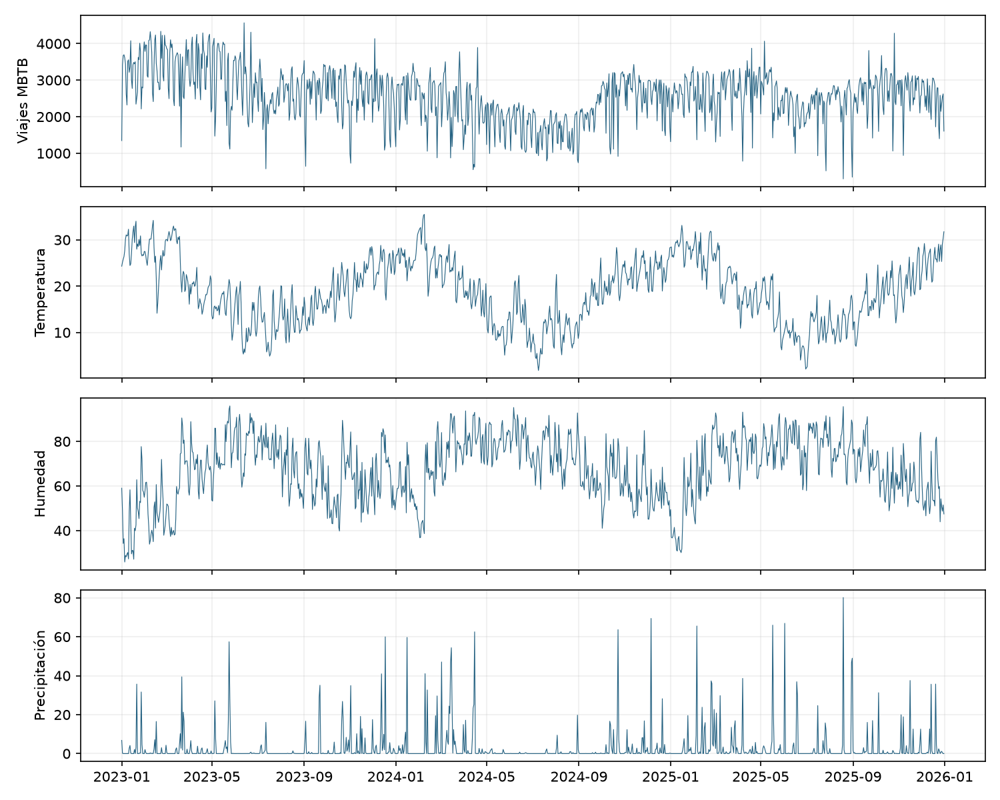

# 3.1. Diferencias y lectura inicial

Viajes muestra un ciclo semanal y cambios de nivel. Temperatura y humedad presentan patrones anuales. Precipitación contiene muchos ceros y picos aislados. El punto 2 propuso diferencias como primera aproximación visual; el punto 4 mostró que no todas eran necesarias o suficientes. La diferencia anual de humedad, por ejemplo, no quedó respaldada por todas las pruebas.

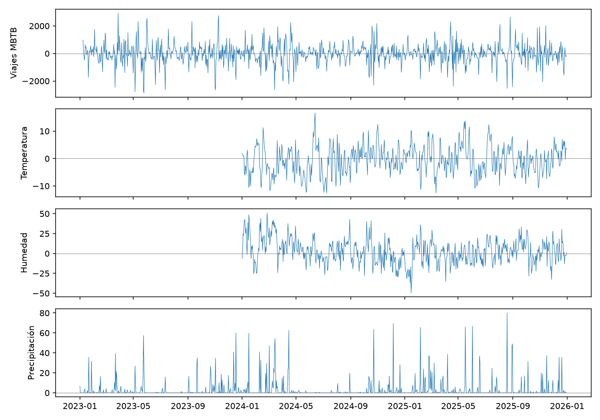

Estos gráficos no constituyen una prueba de estacionariedad. El aumento o la reducción de dispersión después de diferenciar tampoco permite, por sí solo, elegir el mejor modelo.

# 4. Autocorrelación — punto 3

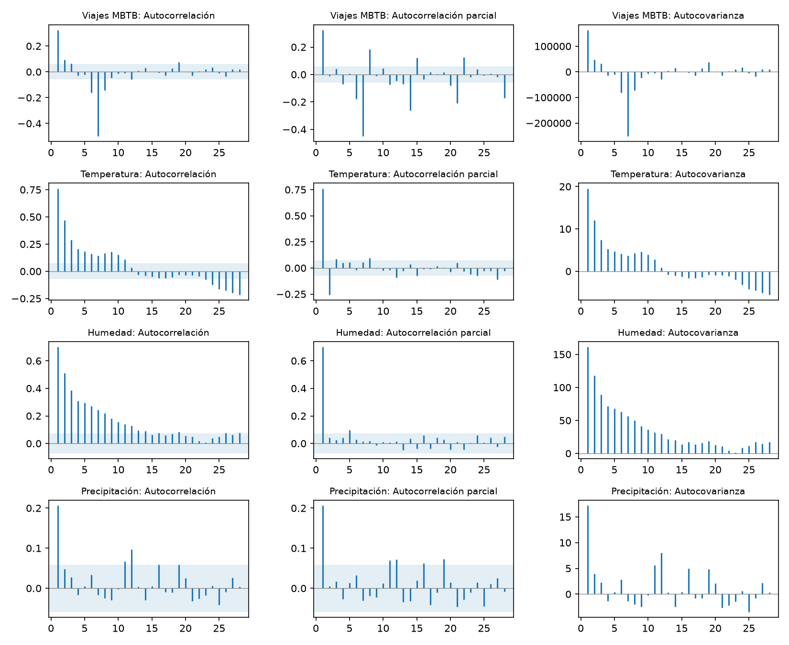

La diferencia semanal de viajes puede introducir una relación negativa en el rezago 7. Por eso no se la toma como obligatoria. En temperatura y humedad se observa dependencia de corto plazo después de la diferencia anual. Precipitación muestra una dependencia más breve. Los órdenes se prueban luego con validación, en lugar de elegirlos solo por la forma de estas barras.

# 4.1. Pruebas de raíces unitarias — punto 4

| serie | ADF | KPSS | PP |
| --- | --- | --- | --- |
| Humedad | 2.372e-06 | ≥ 0.09 | 1.69e-21 |
| Precipitación | 0 | ≥ 0.10 | 0 |
| Temperatura | 0.04058 | ≥ 0.10 | 2.78e-06 |
| Viajes MBTB | 0.1512 | ≤ 0.01 | 0 |

ADF y Phillips–Perron (PP) parten de la hipótesis de raíz unitaria; KPSS parte de estacionariedad. El nivel de referencia es 5%. En KPSS, los valores de los extremos se interpretan como límites del p-valor disponible. En las pruebas de raíz unitaria, un cero numérico indica un valor muy pequeño, no una probabilidad exactamente nula.

Viajes presenta resultados mixtos: ADF no rechaza raíz unitaria, PP sí la rechaza y KPSS rechaza estacionariedad. Temperatura y humedad son compatibles con estacionariedad bajo una media fija, pero algunas conclusiones cambian al incluir tendencia. Precipitación muestra coincidencia a favor de conservar sus niveles. Estas diferencias explican por qué no se aplica la misma transformación a todas las series.

La diferencia anual de humedad no resuelve por sí sola el problema: KPSS todavía rechaza estacionariedad en esa transformación. El análisis visual inicial se considera una propuesta, que luego se revisa con pruebas y predicción. Las pruebas completas, con y sin tendencia, están en resultados_pruebas.csv.

# 5. Selección SARIMA — punto 5

Se estiman 12 candidatos para viajes, 8 para temperatura, 8 para humedad y 4 para precipitación. Se entrenan con el inicio de 2023–2024 y se pronostican sus últimos 90 días. Gana el menor MAE en esa validación. Los parámetros se vuelven a calcular con todo 2023–2024. No se usa el error de 2025 para esta elección.

| Serie | Modelo | MAE validación | n efectivo |
| --- | --- | --- | --- |
| Viajes MBTB | SARIMA(0, 1, 1)×(0, 1, 1, 7) | 424.572 | 731 |
| Temperatura | SARIMA(1, 0, 0)×(0, 1, 0, 365) | 3.141 | 366 |
| Humedad | SARIMA(1, 0, 0)×(0, 0, 0, 0) | 10.388 | 731 |
| Precipitación | SARIMA(1, 0, 1)×(0, 0, 0, 0) | 4.549 | 731 |

La diferencia anual se calcula antes de ajustar los modelos que la incluyen. Por ello se pierden 365 observaciones de estimación y se reconstruyen después las predicciones en unidades originales. Los AIC/BIC solo se interpretan dentro de conjuntos comparables; el MAE de validación permite comparar todas las alternativas en fechas comunes.

Los p-valores individuales de los coeficientes se incluyen en el apéndice. En viajes, el término MA estacional está muy cerca de −1 y su error estándar es grande. Esto sugiere que la representación requiere revisión y coincide con la advertencia del diagnóstico posterior. Un buen resultado de validación no elimina este problema.

La exploración de los puntos 2–4 utilizó todo el período. La separación de entrenamiento y prueba evita usar numéricamente el error de 2025 en la selección, pero no vuelve completamente independiente el conocimiento previo de esos datos.

# 5.1. Entrenamiento y prueba — punto 6

| Serie | Evaluación | n | MAE | RMSE | Sesgo |
| --- | --- | --- | --- | --- | --- |
| Viajes MBTB | Training (1 paso) | 701 | 364.764 | 520.784 | -8.569 |
| Viajes MBTB | Testing (365 días) | 365 | 512.524 | 635.599 | 334.702 |
| Viajes MBTB | Testing (30 días) | 30 | 361.645 | 456.114 | 252.870 |
| Temperatura | Training (1 paso) | 336 | 2.659 | 3.410 | -0.180 |
| Temperatura | Testing (365 días) | 365 | 3.959 | 4.926 | -0.065 |
| Temperatura | Testing (30 días) | 30 | 3.013 | 3.896 | 1.929 |
| Humedad | Training (1 paso) | 701 | 6.097 | 7.968 | 0.191 |
| Humedad | Testing (365 días) | 365 | 11.474 | 13.611 | 3.451 |
| Humedad | Testing (30 días) | 30 | 18.185 | 21.072 | -17.175 |
| Precipitación | Training (1 paso) | 701 | 3.874 | 8.155 | -0.012 |
| Precipitación | Testing (365 días) | 365 | 4.770 | 10.350 | 0.867 |
| Precipitación | Testing (30 días) | 30 | 2.836 | 3.937 | -1.255 |

El entrenamiento usa predicciones de un día con valores reales anteriores, aunque los parámetros se calcularon con todo el entrenamiento. La prueba predice 365 días seguidos desde diciembre de 2024. La brecha de errores no demuestra por sí sola sobreajuste: también cambia la información disponible y el plazo de predicción.

El sesgo anual de viajes es positivo: el modelo tiende a subestimar la demanda. En humedad, enero tiene un error mayor que el promedio del año completo. Un plazo más corto no asegura menor error, porque también cambia el período evaluado.

# 6. Comparación con alternativas — punto 7

| Serie | Menor MAE observado | MAE mejor | MAE SARIMA |
| --- | --- | --- | --- |
| Humedad | Ingenuo estacional | 11.011 | 11.474 |
| Precipitación | Ingenuo estacional | 3.581 | 4.770 |
| Temperatura | SARIMA punto 5 | 3.959 | 3.959 |
| Viajes MBTB | Media | 417.464 | 512.524 |

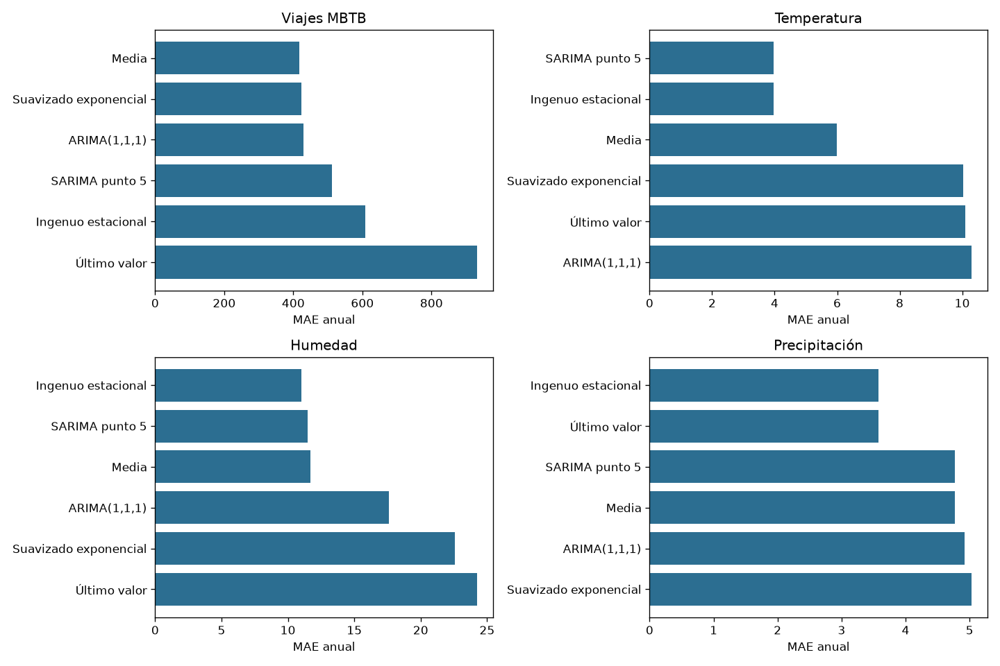

Todos los modelos usan las mismas fechas y predicen desde el mismo origen. La clasificación es descriptiva: no se reutiliza 2025 para seleccionar un ganador definitivo. La comparación completa de 30 y 365 días queda en comparacion_modelos.csv.

# 7. Diagnóstico de residuos — punto 8

| Serie | LB p, 7 días | LB p, 14 días | LB p, 28 días |
| --- | --- | --- | --- |
| Humedad | 0.033 | 0.085 | 0.027 |
| Precipitación | 0.184 | 0.420 | 0.338 |
| Temperatura | 3.7e-08 | 8.67e-07 | 6.95e-05 |
| Viajes MBTB | 1.95e-13 | 1.27e-11 | 1.39e-08 |

| Serie | Jarque–Bera p | ARCH p | Raíz mínima |
| --- | --- | --- | --- |
| Viajes MBTB | 1.18e-113 | 0.000239 | 1.000 |
| Temperatura | 0.170 | 0.737 | 1.309 |
| Humedad | 3.06e-07 | 0.00222 | 1.214 |
| Precipitación | 0.000 | 0.294 | 1.967 |

Ljung–Box detecta autocorrelación en viajes y temperatura en los tres rezagos revisados. En humedad rechaza en 7 y 28 días. En precipitación no rechaza en estos rezagos, pero sus errores se apartan mucho de una distribución normal. La prueba se ajusta por el número de términos AR y MA, incluidos los estacionales (Statsmodels developers, s. f.-b).

Jarque–Bera rechaza normalidad en viajes, humedad y lluvia. ARCH detecta variación del tamaño de los errores en viajes y humedad. Estos resultados afectan especialmente la confianza en intervalos gaussianos. La raíz mínima de viajes está casi en uno: el modelo se aproxima al límite de invertibilidad.

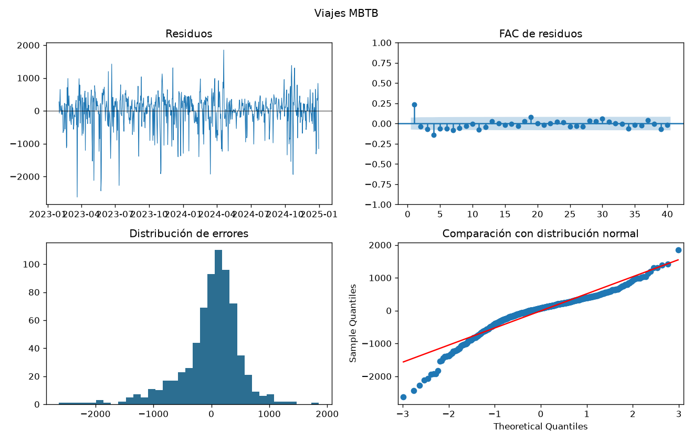

# 7.1. Diagnóstico de las series climáticas

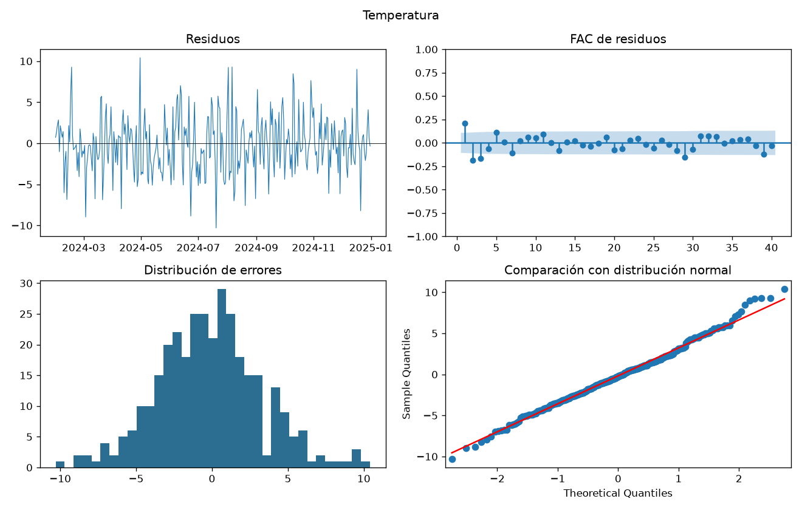

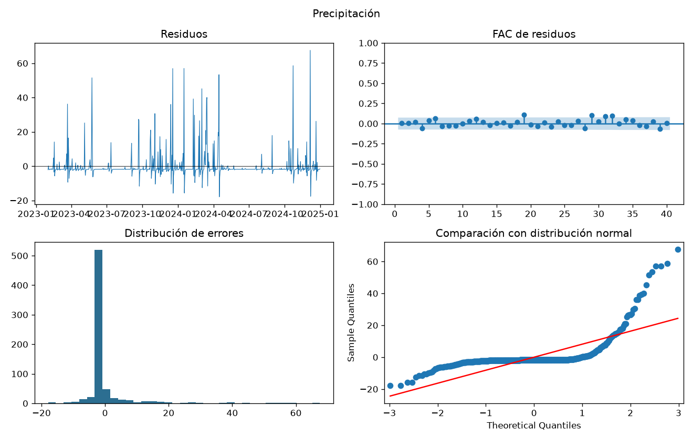

# 8. Pronóstico de 30 días — punto 9

Se conservan los órdenes del punto 5 y se ajustan sus parámetros con 2023–2025. La ventana va del 1 al 30 de enero de 2026, después del último dato disponible. No se compara con observaciones reales de 2026, porque no forman parte de los archivos.

| Serie | Promedio | Mínimo | Máximo |
| --- | --- | --- | --- |
| Humedad | 64.375 | 50.935 | 67.476 |
| Precipitación | 2.939 | 2.340 | 2.967 |
| Temperatura | 28.692 | 24.090 | 33.176 |
| Viajes MBTB | 2271.660 | 1796.059 | 2540.540 |

Las bandas del 95% son intervalos predictivos aproximados bajo el modelo, condicionados a sus parámetros. No incluyen toda la incertidumbre de selección. En la diferencia anual, los valores de hace 365 días son conocidos para este horizonte, por lo que se suman al centro y a los límites. No se recortan intervalos físicamente imposibles.

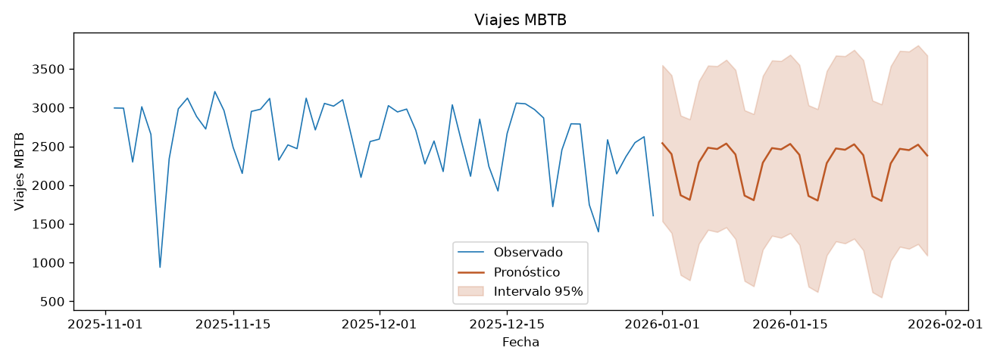

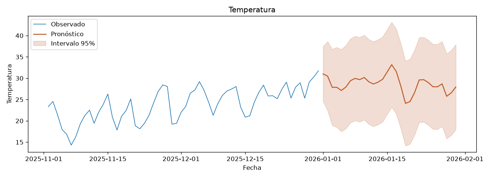

# 8.1. Pronósticos de humedad y precipitación

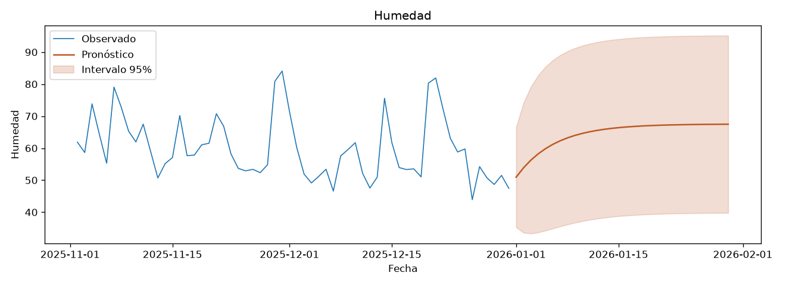

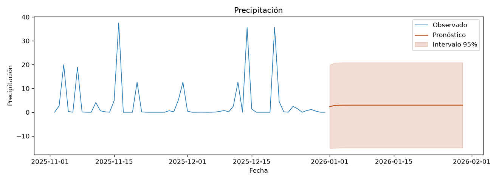

Un límite negativo de lluvia o humedad fuera de 0–100% expone una limitación del modelo lineal. Estas bandas se presentan sin alteraciones para no ocultarla. Los pronósticos climáticos son ejercicios estadísticos y no reemplazan un servicio meteorológico.

# 9. Modelo conjunto VAR — punto 10

Se retiró de cada serie una parte de calendario estimada solo con entrenamiento: tendencia lineal, dos pares de senos y cosenos anuales e indicadores de día de semana. En viajes, KPSS seguía rechazando estacionariedad (p≈0,024), por lo que se agregó una diferencia diaria de sus residuos. Las variables climáticas conservaron los residuos en niveles. Después se dividió cada variable por su desvío.

| Serie | ADF_p | KPSS_p | Coinciden al 5% |
| --- | --- | --- | --- |
| Temperatura | 6.34e-15 | 0.100 | True |
| Humedad | 2.9e-21 | 0.092 | True |
| Precipitación | 1.08e-17 | 0.100 | True |
| Viajes MBTB | 1.89e-20 | 0.100 | True |

BIC eligió dos rezagos entre 1 y 21, con una ventana común para comparar los órdenes. El VAR(2) resultó estable. Se mantuvo como modelo parsimonioso para el ejercicio, aunque la prueba conjunta de residuos rechazó ausencia de autocorrelación. La estabilidad no garantiza que el modelo esté bien especificado.

| Serie | MAE SARIMA | MAE VAR |
| --- | --- | --- |
| Viajes MBTB | 512.524 | 1441.181 |
| Temperatura | 3.959 | 2.761 |
| Humedad | 11.474 | 9.440 |
| Precipitación | 4.770 | 5.266 |

El VAR mejoró el error de temperatura y humedad, pero empeoró viajes y precipitación. Las diferencias de viajes se acumulan para recuperar el nivel antes de sumar el calendario. Esa acumulación puede amplificar el error a plazos largos. No se usaron los valores reales de clima de 2025 para pronosticar la demanda.

Se recalculó el mismo orden con todos los datos y se guardaron 30 predicciones para enero de 2026. Son pronósticos puntuales; no se presentan intervalos que ignoren la acumulación de diferencias o la incertidumbre del calendario.

# 9.1. Evaluación gráfica del VAR

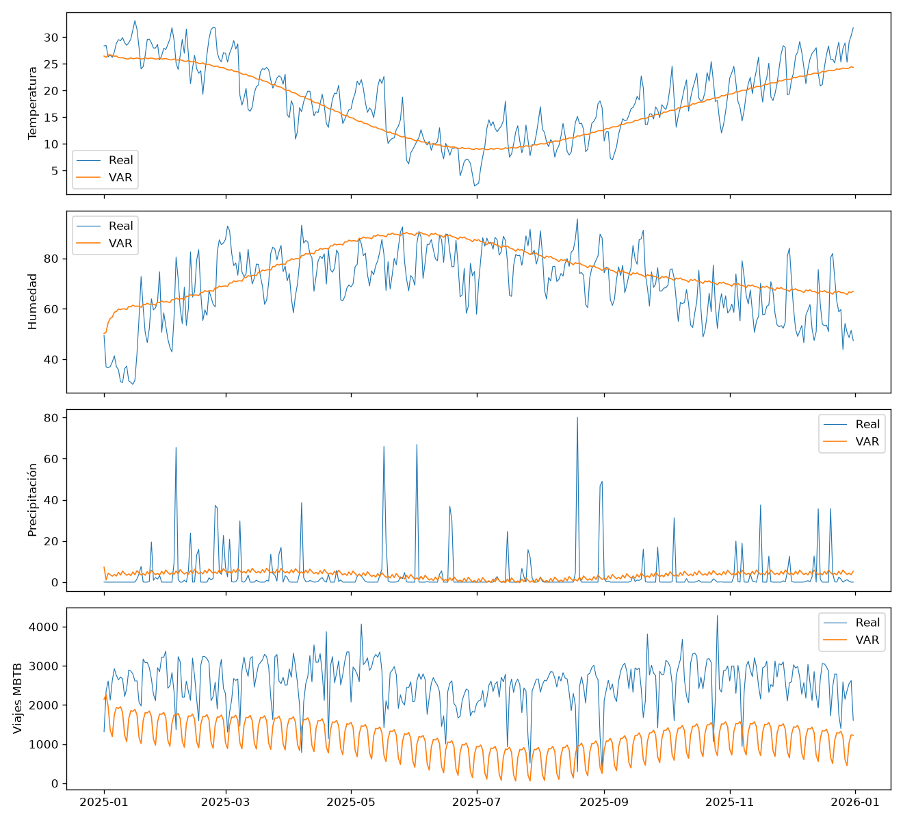

Las diferencias de desempeño muestran que agregar variables no asegura una mejora. El efecto depende de la variable, del plazo y de la forma elegida para retirar los patrones de calendario.

# 10. Impulso-respuesta — punto 11

Se estudian shocks de un desvío estándar en el VAR entrenado con 2023–2024. La separación de Cholesky usa el orden temperatura, humedad, precipitación y viajes. Ubicar viajes al final permite una respuesta del mismo día al clima bajo esta suposición. Cambiar el orden modifica la interpretación de los shocks.

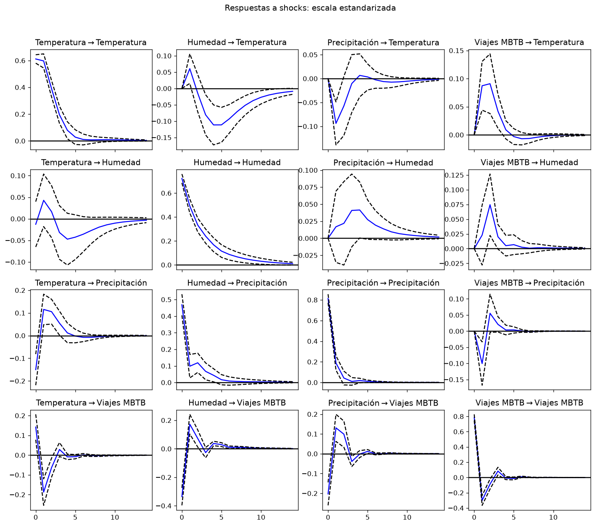

En clima las respuestas corresponden a desvíos del calendario. En viajes corresponden a cambios diarios de esos desvíos. Para hablar del nivel de viajes se acumulan las respuestas. Las bandas son asintóticas y no incorporan la estimación previa del calendario ni resuelven los problemas de residuos del VAR.

# 10.1. Sensibilidad al orden de los shocks

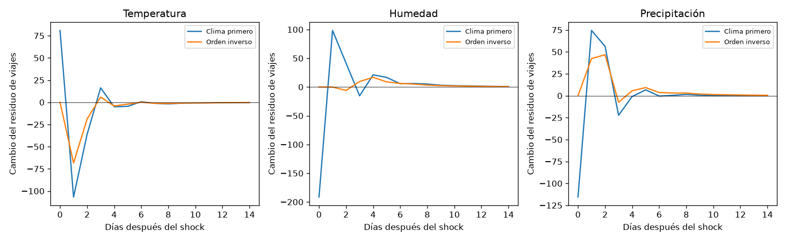

| Shock | Día de mayor respuesta absoluta | Respuesta acumulada (viajes) |
| --- | --- | --- |
| Humedad | 0 | -191.406 |
| Precipitación | 0 | -115.516 |
| Temperatura | 0 | 80.970 |

Las bandas puntuales del 95% para el cambio diario del residuo de viajes excluyen cero en los siguientes días: Humedad: [0, 1, 2, 4, 5, 6, 7, 8, 9, 10, 11, 12, 13, 14]; Precipitación: [0, 1, 2, 3, 5, 8]; Temperatura: [0, 1, 2]. No son bandas simultáneas: mirar muchos días aumenta el riesgo de hallazgos por azar.

La tabla resume el mayor movimiento absoluto del nivel de viajes dentro de los 14 días, bajo el orden principal. Es una descripción de la curva, no una prueba adicional de significatividad. El shock no equivale a aumentar directamente un grado, un punto de humedad o un milímetro: su tamaño depende de la innovación estimada y de la separación de Cholesky.

Las relaciones predictivas que van desde viajes hacia clima no significan que los viajes modifiquen el clima. Pueden reflejar dependencia estadística compartida, variables omitidas o un ajuste incompleto. Esta precaución también se aplica a la dirección clima hacia viajes.

# 10.2. Pruebas de Granger y relación instantánea

| Origen | Destino | F p, Holm | Wald p, Holm | Rechaza F |
| --- | --- | --- | --- | --- |
| Humedad | Temperatura | 1.92e-10 | 1.55e-10 | True |
| Precipitación | Temperatura | 0.036 | 0.035 | True |
| Viajes MBTB | Temperatura | 0.00334 | 0.00327 | True |
| Temperatura | Humedad | 0.115 | 0.115 | False |
| Precipitación | Humedad | 0.733 | 0.733 | False |
| Viajes MBTB | Humedad | 0.105 | 0.105 | False |
| Temperatura | Precipitación | 2.08e-05 | 1.96e-05 | True |
| Humedad | Precipitación | 0.070 | 0.070 | False |
| Viajes MBTB | Precipitación | 0.036 | 0.035 | True |
| Temperatura | Viajes MBTB | 1.12e-05 | 1.05e-05 | True |
| Humedad | Viajes MBTB | 0.733 | 0.733 | False |
| Precipitación | Viajes MBTB | 0.070 | 0.070 | False |
| Clima conjunto | Viajes MBTB | 5.97e-08 | 4.96e-08 | True |

Las pruebas F y Wald contrastan si todos los coeficientes de los rezagos de una variable son cero en otra ecuación, con las demás variables incluidas. Se ajustaron los p-valores de las 12 direcciones y la prueba conjunta mediante Holm, por separado para F y Wald. Ambas pruebas contrastan la misma hipótesis y no aportan evidencia independiente.

Para el destino viajes, las pruebas F con ajuste detectan información adicional de: Temperatura, Clima conjunto. El resultado corresponde al cambio del residuo de viajes, no directamente al nivel original. Las pruebas instantáneas también detectan relación contemporánea; no identifican una dirección causal.

Dado que el VAR conserva autocorrelación residual, estos p-valores se presentan como aproximaciones exploratorias. No se extrae una recomendación de intervención ni una conclusión causal.

# 11. Revisión de estacionalidad — punto 12

| Serie | Alternativa | MAE validación | MAE 2025 | Elegido |
| --- | --- | --- | --- | --- |
| Viajes MBTB | SARIMA punto 5 | 424.572 | 512.524 | True |
| Viajes MBTB | SARIMA semanal + ciclo anual | 1596.679 | 2429.394 | False |
| Temperatura | SARIMA punto 5 | 3.141 | 3.959 | False |
| Temperatura | Ciclo anual + AR(1) | 2.514 | 2.653 | True |
| Humedad | SARIMA punto 5 | 10.388 | 11.474 | False |
| Humedad | Ciclo anual + AR(1) | 6.771 | 8.745 | True |
| Precipitación | SARIMA punto 5 | 4.549 | 4.770 | True |

La alternativa anual usa dos pares de senos y cosenos. En viajes añade una tendencia y errores SARIMA semanales; en temperatura y humedad, errores AR(1). Técnicamente se trata de regresión de calendario con errores SARIMA, también llamada SARIMAX, porque incluye funciones conocidas de la fecha. No utiliza clima futuro observado.

La validación mantuvo el modelo previo de viajes y favoreció el ciclo anual con AR(1) en temperatura y humedad. La precipitación no se modificó. En 2025, las alternativas seleccionadas redujeron el MAE climático, mientras que la opción adicional de viajes tuvo un desempeño mucho peor. Un patrón más elaborado no siempre ayuda.

La misma validación ya había servido para elegir órdenes. Seguir probando opciones en ella aumenta el riesgo de adaptarse demasiado a esos 90 días. Además, los modelos nuevos necesitan su propio diagnóstico antes de reemplazar los del punto 5. El punto 9 conserva los pronósticos de los modelos originales por continuidad del análisis.

No se encontró otro trabajo anterior en las carpetas. La referencia de comparación es, por lo tanto, el punto 5 de este proyecto. Esta elección se explicita para no atribuir resultados a un documento no disponible.

# 11.1. Comparación de las representaciones estacionales

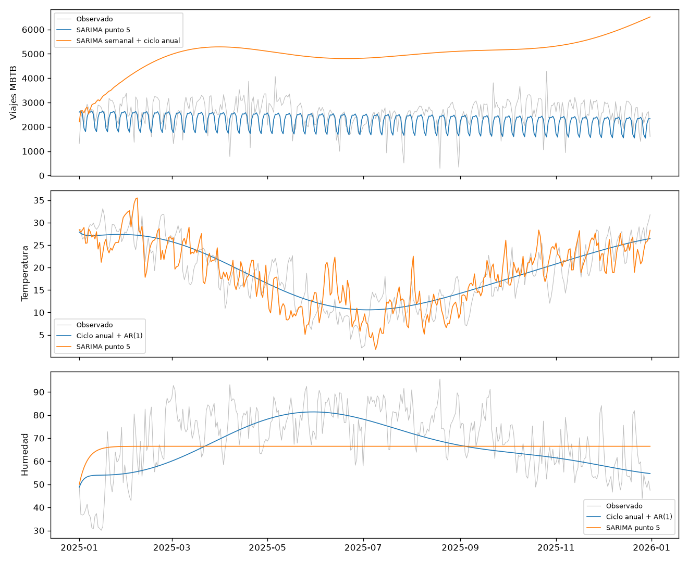

El calendario suave describe un patrón anual esperado. La diferencia anual, en cambio, usa el valor del ciclo anterior como referencia. Son supuestos distintos y sus resultados dependen de la estabilidad del patrón entre años.

# 12. Conclusiones

El trabajo muestra que las cuatro series requieren decisiones diferentes. Viajes tiene una estructura semanal y cambios de nivel; temperatura y humedad presentan ciclos anuales; lluvia concentra muchos ceros y episodios intensos. No resulta adecuado diferenciar todas las variables de la misma forma ni elegir un único tipo de modelo por conveniencia.

La separación temporal permitió medir error posterior a la estimación. El SARIMA semanal fue la opción elegida inicialmente para viajes; la temperatura utilizó una diferencia anual; humedad y lluvia conservaron modelos sin diferencia estacional. La comparación con alternativas mostró que la complejidad no asegura el menor error.

Los residuos impiden considerar definitivos los modelos univariados. Persisten autocorrelaciones en viajes, temperatura y humedad, y las distribuciones de errores se apartan de normalidad en varias series. Por ello, los pronósticos e intervalos deben interpretarse como aproximaciones y no como garantías de desempeño.

El VAR integró la información de las cuatro variables. Mejoró las predicciones de algunas variables climáticas, pero no la demanda ni la lluvia. Las pruebas de Granger y las respuestas a shocks describen relaciones del modelo; la autocorrelación restante, el orden de Cholesky y las variables omitidas impiden una interpretación causal.

La revisión anual mejoró los resultados de temperatura y humedad dentro del conjunto probado. Una continuación razonable sería evaluar varios cortes temporales, incorporar calendario operativo y disponibilidad del servicio, y estudiar modelos que respeten la naturaleza no negativa y con muchos ceros de la lluvia. Estas mejoras requieren nueva validación y no se presentan como resultados ya obtenidos.

El aporte principal es un análisis reproducible con decisiones y límites visibles. Los archivos permiten revisar cómo se seleccionó cada modelo, qué información tuvo al predecir y dónde falla. La utilidad operativa depende de actualizar los datos, confirmar su procedencia y volver a medir el desempeño.

# 13. Referencias

Municipalidad de Rosario. (s. f.). Datos Abiertos Rosario. https://datos.rosario.gob.ar/ — Portal atribuido a viajes en el punto 1; el proyecto no conserva la consulta exacta de descarga.

Statsmodels developers. (s. f.-a). Vector autoregressions. https://www.statsmodels.org/stable/vector_ar.html

Statsmodels developers. (s. f.-b). statsmodels.stats.diagnostic.acorr_ljungbox. https://www.statsmodels.org/stable/generated/statsmodels.stats.diagnostic.acorr_ljungbox.html

Statsmodels developers. (s. f.-c). statsmodels.tsa.statespace.sarimax.SARIMAX. https://www.statsmodels.org/stable/generated/statsmodels.tsa.statespace.sarimax.SARIMAX.html

Statsmodels developers. (s. f.-d). Augmented Dickey–Fuller unit root test. https://www.statsmodels.org/stable/generated/statsmodels.tsa.stattools.adfuller.html

Statsmodels developers. (s. f.-e). Kwiatkowski–Phillips–Schmidt–Shin test. https://www.statsmodels.org/stable/generated/statsmodels.tsa.stattools.kpss.html

Sheppard, K. (s. f.). Phillips–Perron unit root test. arch. https://bashtage.github.io/arch/unitroot/generated/arch.unitroot.PhillipsPerron.html

Universidad Austral. (s. f.). Trabajo Práctico N.º 1: Análisis de Series Temporales [Consigna de cátedra]. Maestría en Ciencia de Datos. Documento suministrado en el proyecto.

Fuente de las figuras y tablas: elaboración propia con los archivos del proyecto. La documentación de software explica los métodos implementados; no valida la procedencia de los datos ni las conclusiones empíricas de este caso.

# Apéndice A. Parámetros de los modelos SARIMA

| Serie | Parámetro | Estimación | Error estándar | p-valor |
| --- | --- | --- | --- | --- |
| Viajes MBTB | ma.L1 | -0.796 | 0.020 | 0.000 |
| Viajes MBTB | ma.S.L7 | -1.000 | 0.920 | 0.277 |
| Viajes MBTB | sigma2 | 263125.596 | 239622.282 | 0.272 |
| Temperatura | ar.L1 | 0.764 | 0.035 | 7.06e-104 |
| Temperatura | sigma2 | 11.384 | 0.791 | 6.25e-47 |
| Humedad | intercept | 11.708 | 1.540 | 2.9e-14 |
| Humedad | ar.L1 | 0.824 | 0.023 | 6.9e-286 |
| Humedad | sigma2 | 65.339 | 3.200 | 1.09e-92 |
| Precipitación | intercept | 1.317 | 0.599 | 0.028 |
| Precipitación | ar.L1 | 0.508 | 0.107 | 2.13e-06 |
| Precipitación | ma.L1 | -0.281 | 0.117 | 0.016 |
| Precipitación | sigma2 | 66.861 | 1.996 | 5.4e-246 |

Los p-valores suponen que la especificación y la aproximación de la inferencia son adecuadas. En particular, la cercanía del término estacional de viajes al límite de invertibilidad hace poco confiable una lectura mecánica de su error estándar. Un p-valor numéricamente cero representa un número muy pequeño.

# Apéndice B. Ejecución y organización de archivos

La entrega se compone de TP1_informe.pdf y tp1_reproducible.py. El segundo archivo contiene una copia comprimida de los CSV, los notebooks sin salidas y las funciones necesarias. Se puede ejecutar fuera de este proyecto. No descarga datos nuevos ni modifica las carpetas originales.

Requisitos: Python 3.12 o compatible, pandas, NumPy, SciPy, Matplotlib, seaborn, statsmodels, arch, nbformat, nbclient, ipykernel y reportlab. Las versiones del entorno utilizado se registran en versiones_entorno.txt. Se recomienda instalarlas en un entorno virtual.

Ejemplo de ejecución: python tp1_reproducible.py --output reproduccion_tp1. El programa requiere una carpeta vacía, extrae los archivos, ejecuta los puntos 2 al 12 en orden y genera nuevamente el informe. La opción --solo-extraer permite revisar el código y los datos antes de ejecutar los cálculos. El punto 1 es un texto y los puntos 13–14 se materializan en este informe y su estructura.

Los módulos modelos_puntos56.py y modelos_resto.py contienen los cálculos comunes. Los notebooks explican cada decisión y llaman a esas funciones. crear_informe.py reúne las tablas y gráficos calculados. Los scripts build_* reconstruyen las celdas, pero no son necesarios para leer los notebooks entregados.

| Puntos | Archivos principales |
| --- | --- |
| 5–6 | Selección, parámetros y errores de entrenamiento/prueba |
| 7 | Comparación y predicciones de alternativas |
| 8 | Residuos, Ljung–Box, normalidad y ARCH |
| 9 | Pronósticos e intervalos de 30 días |
| 10 | VAR, criterios, coeficientes, errores y pronósticos |
| 11 | Granger, relaciones instantáneas y respuestas a shocks |
| 12 | Comparación de estacionalidad y elección por validación |

La repetición numérica puede variar ligeramente entre versiones de bibliotecas y sistemas. Los índices temporales, reglas de selección y períodos de evaluación quedan explícitos para detectar diferencias sustantivas.
